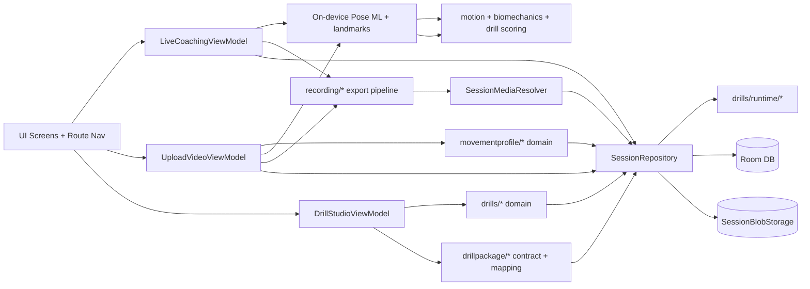

# Diagram: Architecture Subsystems

```mermaid
flowchart LR
    UI[UI Screens + Route Nav]
    LIVE[LiveCoachingViewModel]
    UPLOAD[UploadVideoViewModel]
    STUDIO[DrillStudioViewModel]
    DRILLPKG[drillpackage/* contract + mapping]
    RUNTIME[drills/runtime/*]
    DRILLS[drills/* domain]
    MOVE[movementprofile/* domain]
    POSEML[On-device Pose ML + landmarks]
    ANALYSIS[motion + biomechanics + drill scoring]
    RECORD[recording/* export pipeline]
    MEDIA[SessionMediaResolver]
    REPO[SessionRepository]
    DB[(Room DB)]
    BLOB[(SessionBlobStorage)]

    UI --> LIVE
    UI --> UPLOAD
    UI --> STUDIO

    LIVE --> POSEML --> ANALYSIS
    LIVE --> RECORD

    UPLOAD --> MOVE
    UPLOAD --> POSEML --> ANALYSIS
    UPLOAD --> RECORD

    STUDIO --> DRILLS
    STUDIO --> DRILLPKG
    DRILLPKG --> REPO
    REPO --> RUNTIME

    DRILLS --> REPO
    MOVE --> REPO
    LIVE --> REPO
    UPLOAD --> REPO

    RECORD --> MEDIA --> REPO

    REPO --> DB
    REPO --> BLOB
```
