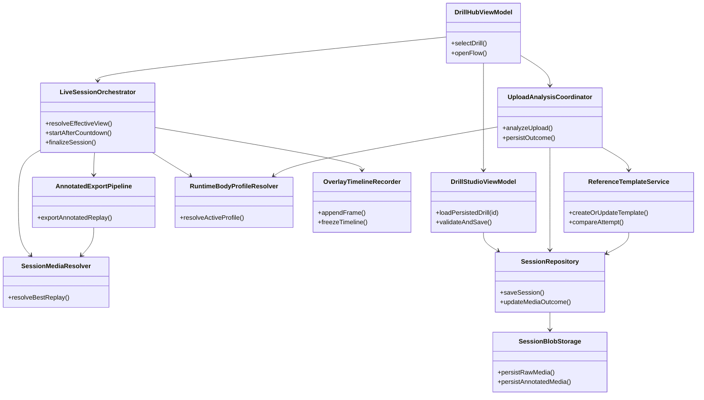

# Class Diagram (Drill-Centric Ownership)

```mermaid
classDiagram
    class DrillHubViewModel {
      +selectDrill()
      +openFlow()
    }
    class DrillStudioViewModel {
      +loadPersistedDrill(id)
      +validateAndSave()
    }
    class LiveSessionOrchestrator {
      +resolveEffectiveView()
      +startAfterCountdown()
      +finalizeSession()
    }
    class UploadAnalysisCoordinator {
      +analyzeUpload()
      +persistOutcome()
    }
    class ReferenceTemplateService {
      +createOrUpdateTemplate()
      +compareAttempt()
    }
    class RuntimeBodyProfileResolver {
      +resolveActiveProfile()
    }
    class OverlayTimelineRecorder {
      +appendFrame()
      +freezeTimeline()
    }
    class AnnotatedExportPipeline {
      +exportAnnotatedReplay()
    }
    class SessionMediaResolver {
      +resolveBestReplay()
    }
    class SessionRepository {
      +saveSession()
      +updateMediaOutcome()
    }
    class SessionBlobStorage {
      +persistRawMedia()
      +persistAnnotatedMedia()
    }

    DrillHubViewModel --> LiveSessionOrchestrator
    DrillHubViewModel --> UploadAnalysisCoordinator
    DrillHubViewModel --> DrillStudioViewModel
    DrillStudioViewModel --> SessionRepository
    LiveSessionOrchestrator --> OverlayTimelineRecorder
    LiveSessionOrchestrator --> AnnotatedExportPipeline
    LiveSessionOrchestrator --> SessionMediaResolver
    LiveSessionOrchestrator --> RuntimeBodyProfileResolver
    UploadAnalysisCoordinator --> ReferenceTemplateService
    UploadAnalysisCoordinator --> SessionRepository
    UploadAnalysisCoordinator --> RuntimeBodyProfileResolver
    AnnotatedExportPipeline --> SessionMediaResolver
    SessionRepository --> SessionBlobStorage
    ReferenceTemplateService --> SessionRepository
```
