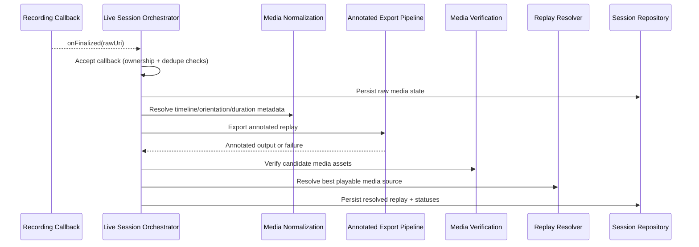

# Sequence: Export Finalization

```mermaid
sequenceDiagram
    participant REC as Recording Callback
    participant ORCH as Live Session Orchestrator
    participant NORM as Media Normalization
    participant EXP as Annotated Export Pipeline
    participant VERIFY as Media Verification
    participant RES as Replay Resolver
    participant REPO as Session Repository

    REC-->>ORCH: onFinalized(rawUri)
    ORCH->>ORCH: Accept callback (ownership + dedupe checks)
    ORCH->>REPO: Persist raw media state
    ORCH->>NORM: Resolve timeline/orientation/duration metadata
    ORCH->>EXP: Export annotated replay
    EXP-->>ORCH: Annotated output or failure
    ORCH->>VERIFY: Verify candidate media assets
    ORCH->>RES: Resolve best playable media source
    ORCH->>REPO: Persist resolved replay + statuses
```
