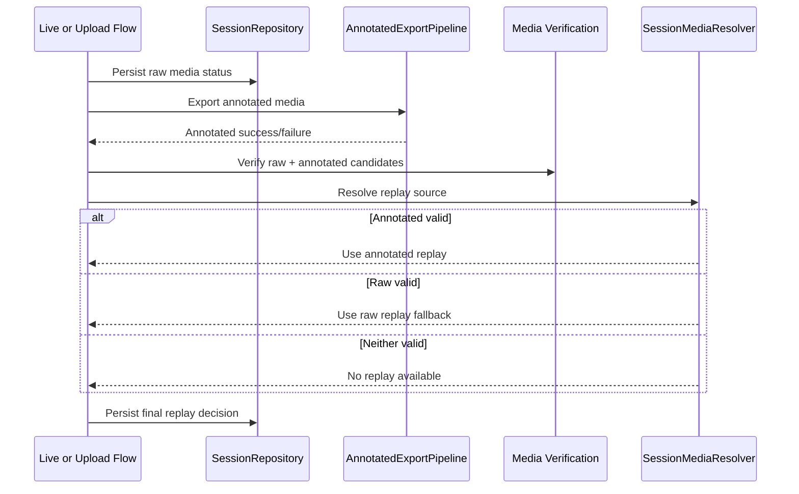

# Sequence: Export / Replay / Fallback

```mermaid
sequenceDiagram
    participant Flow as Live or Upload Flow
    participant Repo as SessionRepository
    participant Export as AnnotatedExportPipeline
    participant Verify as Media Verification
    participant Resolver as SessionMediaResolver

    Flow->>Repo: Persist raw media status
    Flow->>Export: Export annotated media
    Export-->>Flow: Annotated success/failure
    Flow->>Verify: Verify raw + annotated candidates
    Flow->>Resolver: Resolve replay source

    alt Annotated valid
      Resolver-->>Flow: Use annotated replay
    else Raw valid
      Resolver-->>Flow: Use raw replay fallback
    else Neither valid
      Resolver-->>Flow: No replay available
    end

    Flow->>Repo: Persist final replay decision
```
