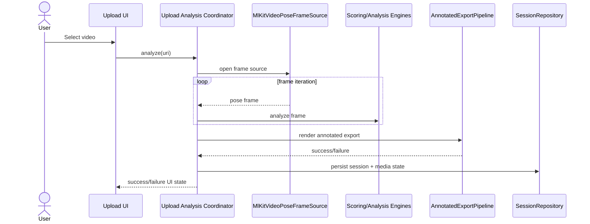

# Sequence: Imported Video Analysis

```mermaid
sequenceDiagram
  actor User
  participant UI as Upload UI
  participant COORD as Upload Analysis Coordinator
  participant SRC as MlKitVideoPoseFrameSource
  participant SCORE as Scoring/Analysis Engines
  participant EXP as AnnotatedExportPipeline
  participant REPO as SessionRepository

  User->>UI: Select video
  UI->>COORD: analyze(uri)
  COORD->>SRC: open frame source
  loop frame iteration
    SRC-->>COORD: pose frame
    COORD->>SCORE: analyze frame
  end
  COORD->>EXP: render annotated export
  EXP-->>COORD: success/failure
  COORD->>REPO: persist session + media state
  COORD-->>UI: success/failure UI state
```
