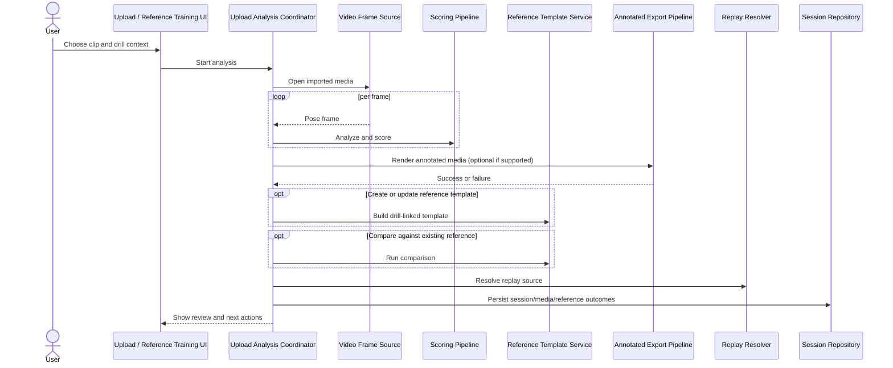

# Sequence: Upload / Reference Analysis

```mermaid
sequenceDiagram
    actor User
    participant UI as Upload / Reference Training UI
    participant COORD as Upload Analysis Coordinator
    participant SRC as Video Frame Source
    participant SCORE as Scoring Pipeline
    participant REF as Reference Template Service
    participant EXP as Annotated Export Pipeline
    participant RES as Replay Resolver
    participant REPO as Session Repository

    User->>UI: Choose clip and drill context
    UI->>COORD: Start analysis
    COORD->>SRC: Open imported media
    loop per frame
      SRC-->>COORD: Pose frame
      COORD->>SCORE: Analyze and score
    end
    COORD->>EXP: Render annotated media (optional if supported)
    EXP-->>COORD: Success or failure
    opt Create or update reference template
      COORD->>REF: Build drill-linked template
    end
    opt Compare against existing reference
      COORD->>REF: Run comparison
    end
    COORD->>RES: Resolve replay source
    COORD->>REPO: Persist session/media/reference outcomes
    COORD-->>UI: Show review and next actions
```
