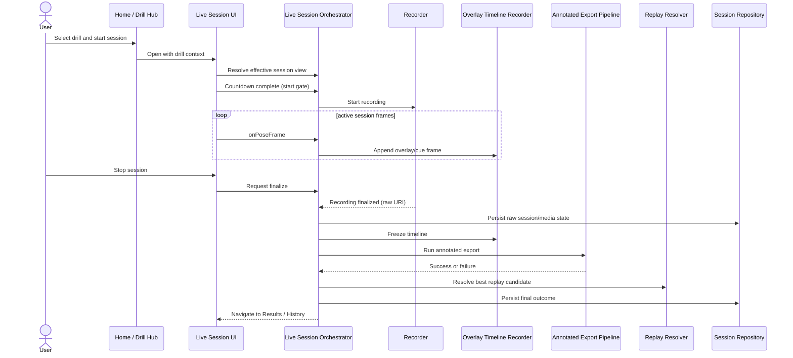

# Sequence: Live Session

```mermaid
sequenceDiagram
    actor User
    participant HUB as Home / Drill Hub
    participant LIVEUI as Live Session UI
    participant ORCH as Live Session Orchestrator
    participant REC as Recorder
    participant OVR as Overlay Timeline Recorder
    participant EXP as Annotated Export Pipeline
    participant RES as Replay Resolver
    participant REPO as Session Repository

    User->>HUB: Select drill and start session
    HUB->>LIVEUI: Open with drill context
    LIVEUI->>ORCH: Resolve effective session view
    LIVEUI->>ORCH: Countdown complete (start gate)
    ORCH->>REC: Start recording
    loop active session frames
      LIVEUI->>ORCH: onPoseFrame
      ORCH->>OVR: Append overlay/cue frame
    end
    User->>LIVEUI: Stop session
    LIVEUI->>ORCH: Request finalize
    REC-->>ORCH: Recording finalized (raw URI)
    ORCH->>REPO: Persist raw session/media state
    ORCH->>OVR: Freeze timeline
    ORCH->>EXP: Run annotated export
    EXP-->>ORCH: Success or failure
    ORCH->>RES: Resolve best replay candidate
    ORCH->>REPO: Persist final outcome
    ORCH-->>LIVEUI: Navigate to Results / History
```
