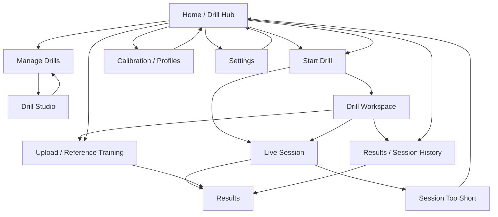

# Diagram: UI Workflow Overview

```mermaid
flowchart TD
    HOME[Home / Drill Hub]
    START[Start Drill]
    LIVE[Live Session]
    SHORT[Session Too Short]
    RESULTS[Results]
    HISTORY[Results / Session History]

    MANAGE[Manage Drills]
    STUDIO[Drill Studio]
    WORKSPACE[Drill Workspace]

    UPLOAD[Upload / Reference Training]
    CAL[Calibration / Profiles]
    SETTINGS[Settings]

    HOME --> START --> LIVE
    LIVE --> RESULTS
    LIVE --> SHORT --> HOME

    HOME --> MANAGE --> STUDIO --> MANAGE
    HOME --> START --> WORKSPACE
    WORKSPACE --> LIVE
    WORKSPACE --> UPLOAD
    WORKSPACE --> HISTORY

    HOME --> UPLOAD --> RESULTS
    HOME --> HISTORY
    HISTORY --> RESULTS

    HOME --> CAL --> HOME
    HOME --> SETTINGS --> HOME
```
