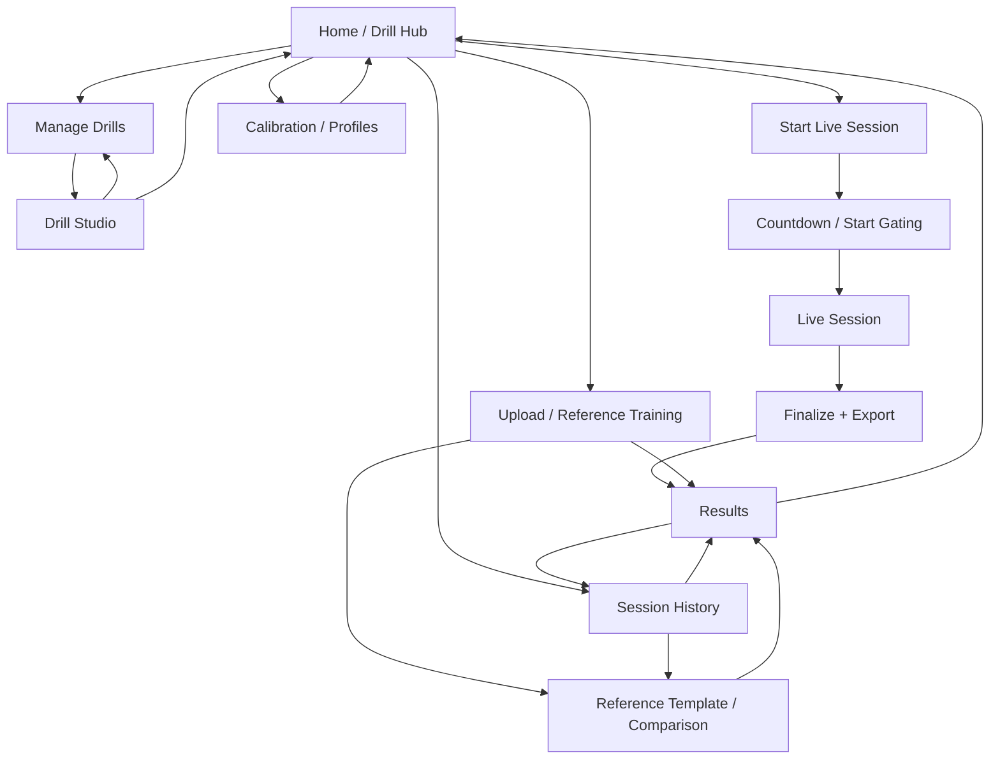

# UI Flow

```mermaid
flowchart TD
    HOME[Home / Drill Hub]
    MANAGE[Manage Drills]
    STUDIO[Drill Studio]
    START[Start Live Session]
    COUNTDOWN[Countdown / Start Gating]
    LIVE[Live Session]
    FINALIZE[Finalize + Export]
    RESULTS[Results]
    HISTORY[Session History]
    UPLOAD[Upload / Reference Training]
    REF[Reference Template / Comparison]
    CAL[Calibration / Profiles]

    HOME --> START
    HOME --> MANAGE
    HOME --> UPLOAD
    HOME --> HISTORY
    HOME --> CAL

    MANAGE --> STUDIO
    STUDIO --> MANAGE
    STUDIO --> HOME

    START --> COUNTDOWN
    COUNTDOWN --> LIVE
    LIVE --> FINALIZE
    FINALIZE --> RESULTS
    RESULTS --> HISTORY
    RESULTS --> HOME

    UPLOAD --> RESULTS
    UPLOAD --> REF
    REF --> RESULTS

    HISTORY --> RESULTS
    HISTORY --> REF

    CAL --> HOME
```
